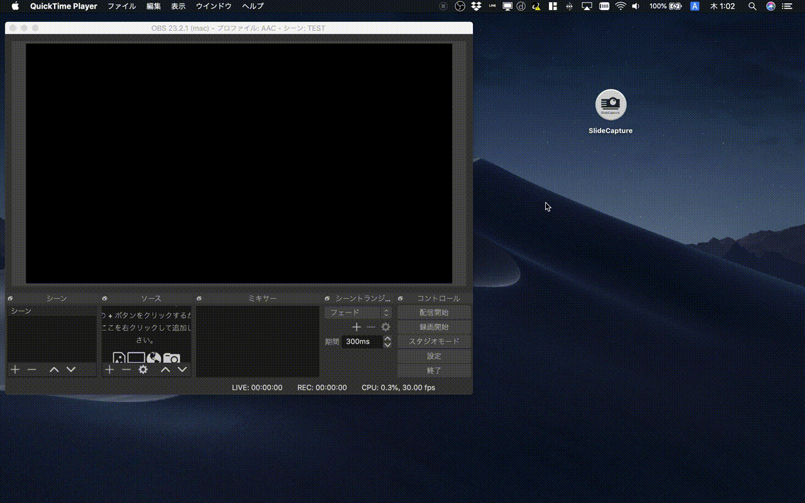

# SlideCapture

## 概要
学会発表での中継業務を簡略化するためのアプリケーション。上記gif ではわかりやすいようにイラスト屋さんの画像を利用していますが、実際はウェブカメラからのキャプチャ画像になります。
  1. ウェブカメラとPC（mac）をもって学会会場へ
  2. 会場の前の方に座る
  3. カメラを発表スライドがはいるように設置
  4. SlideCaptureを立ち上げ、スライド領域を選択
  5. OBSを立ち上げて、syphonクライアントからSlide, Fullの２つをシーンに追加
  6. OBSのシーンを整えて中継を始める

  以上の手順で、従来は中継の簡素化のために犠牲になっていた、歪んだスライドを、矩形としてきっちり取り出した画像に容易に修正することができます。また、キャプチャした画像はsyphonプロトコルを通じてOBS(Open Broadcaster Software, https://obsproject.com )に直接キャプチャ動画として渡すことができます。
  
  ## 背景
  学会発表のインターネット配信が広まる昨今、特に情報処理学会では運営側にとって中継業務が負担となっています。とくに配信の品質を維持するためには従来はビデオミキサー、カメラ、マイク等多くの機材を利用する必要があるため、当日の設置や機材管理業務がセットになり、更に運営側の負担を増やしています。全国大会等では予算をつけ、機材を揃えて、高品質な中継映像を配信をしても良いかと思いますが、日々の研究発表会の中では基本ボランティアで運営委員が業務にあたることがほとんどです。これが運営委員（若手）にとって大きな負担となっています。

  このような人的、金銭的コストを減らすため、もっとも簡単な配信方法として、PCとウェブカメラだけを利用した配信手法があります。発表者のスライドキャプチャをウェブカメラから直接行うため、システムを簡素化し、設置にかかるコストを大幅に削減できます。その一方で、スライドが歪んでいて読みづらい、小さな文字が潰れてしまう、発表者が自身を映してほしくない希望がある場合の対応が困難、といったデメリットが生じます。

  そこでこのアプリケーションでは、歪んだスライドを簡単に短形に射影でき、主要配信ソフトウェアと簡単に連携可能とすることで、中継業務における若手の手間をへらすことを目指しています。
 
 ## アプリケーション
アプリケーションはこのgitをcloneすれば SlideCapture/bin/SlideCapture.app があるので、それをそのまま使っても構いません。ソースコードとかはいらないので、アプリだけっていう場合は下記ページからダウンロードしてください。
  * http://tetsuakibaba.jp/ws/doku.php?id=アプリケーション:slidecapture
  ## 開発環境
  ビルドするための環境を以下に記述します。oFに関する環境やaddon追加等はこのページでは解説しません。

  * Openframeworks version.0.10.1
    * addon
      * ofxSyphon: https://github.com/astellato/ofxSyphon
      * ofxHomograpy: https://github.com/paulobarcelos/ofxHomography
 * OS: macOS(Mojave)

 ## Windows対応
 Windowsではアプリケーション間の動画渡しとして、Spout が利用可能です。Windowsに移植する場合は、ofxSyphonの代わりに ofxSpout(https://github.com/elliotwoods/ofxSpout)を利用してください。そして作ったら教えてくれると嬉しいです。

 